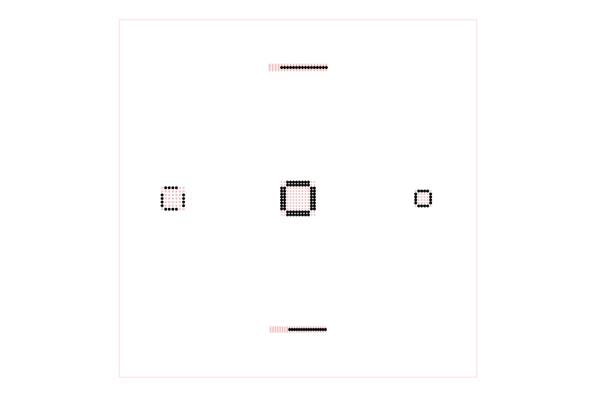

# dataset-srj26-bus-routing

Synthetic tscircuit routing dataset for dense buses escaping a central BGA to
fine-pitch connectors and DRAM-style BGAs.

This starter intentionally contains one sample for review:

- `boards/sample001-four-bus-bga-breakout.circuit.tsx`
- 144-pin, 0.5 mm-pitch central BGA
- four 16-signal buses
- 0.4 mm and 0.5 mm-pitch connectors
- 0.5 mm and 0.6 mm-pitch DRAM-style BGAs
- one direct `<trace>` per signal, with no manual `pcbPath` or fixed vias
- the default tscircuit autorouter owns both component breakout and long bus
  routing, including deciding which signals need vias

## Develop

```sh
bun install
bun run typecheck
bun run build
bun run snapshot
```

Additional samples should only be added after `sample001` has been reviewed.

## Example

`samples/sample001-four-bus-bga-breakout.srj.json` is generated from the board
source with routing disabled. The image below is then generated by constructing
an `AutoroutingPipelineSolver`, calling `.visualize()`, and converting the
graphics object to SVG with `graphics-debug`.



Regenerate both assets with `bun run generate:catalog-assets`.

## Browse and deploy

Run `bun run cosmos` for the React Cosmos catalog. `bun run build:site` exports
it to `cosmos-export/`, the output directory configured for Vercel.
